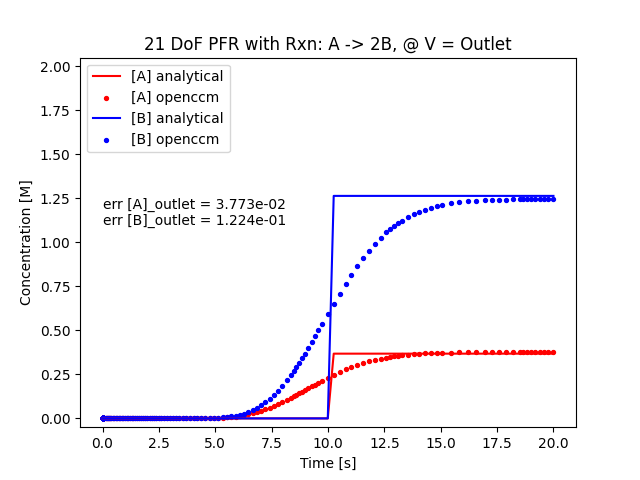
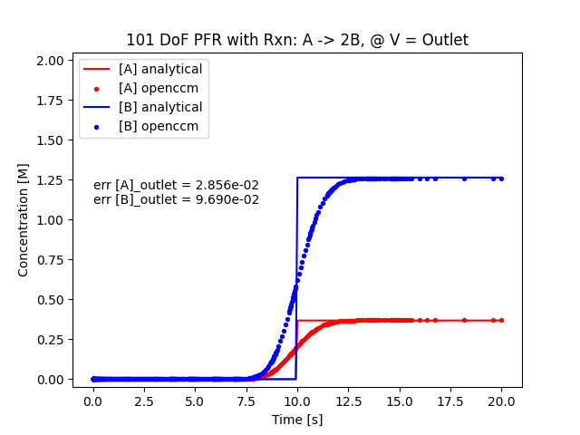

# PFR Example: Irreversible Linear Reaction

## Reaction System

Suppose we have the following irreversible linear reaction: $$ a \rightarrow 2b $$ with a first-order kinetic rate constant $k = 0.1$ $s^{-1}$.

The reaction rates are easily derived, and are: 
$$ r_a = -k a $$
$$ r_b = 2 k a $$

## PFR Mass Balance

A transient mass balance for a species $p$ in a PFR is as follows (note that herein the concentration as a function of time, $C_p(t)$, is shortened to just $p$ for brevity). 
$$ \frac{\partial p}{\partial t} = -Q\frac{\partial p}{\partial V} + r_p $$ 
where $Q$ is the volumetric feed rate. This formula will be used to solve the coupled partial differential equation system for species $a$ and $b$. 

### Mass Balance for $a$

The mass balance for species $a$ is $$ \frac{\partial a}{\partial t} = -Q\frac{\partial a}{\partial V} + -ka $$
We will use generic boundary and initial conditions, i.e. $ a(0, t) = a_{BC}$ and $ a(V, 0) = a_0 $. 

We will make good use of the Laplace transform ($\mathscr{L}$). Applying the Laplace transform on our transient function $a(V, t)$ yields $ \mathscr{L}(a) = A(V, s) $. Applying the Laplace transform on the governing PDE we obtain $$ sA(V,s) - a_0 = -Q\frac{\partial A}{\partial V} - kA(V,s) $$

This equation can be re-written in a convenient form to use the integrating factor method: $$ \left( \frac{s+k}{Q} \right) A + \frac{\partial A}{\partial V} = \frac{a_0}{Q}$$

Using the integrating factor method, this ODE is easily solved:
$$ \frac{\partial A}{\partial V}\left( Ae^{(s+k)V/Q} \right) = \frac{a_0}{Q} e^{(s+k)V/Q} $$
$$ Ae^{(s+k)V/Q} = \left( \frac{a_0}{s+k}\right)e^{(s+k)V/Q}  + \alpha $$
$$ A(V, s) = \frac{a_0}{s+k} + \alpha e^{-(s+k)V/Q} $$

Converting the boundary condition using the Laplace transform yields $ A(0, s) = \frac{a_{BC}}{s} $.
Now implementing this BC we have 
$$ \alpha = \frac{a_{BC}}{s} - \frac{a_0}{s+k} $$

And thus we have the final form for species $a$ in the Laplace domain:
$$ A(V, s) = \frac{a_0}{s+k} + \left( \frac{a_{BC}}{s} \right)e^{-(s+k)V/Q} - \left( \frac{a_0}{s+k} \right)e^{-(s+k)V/Q}$$

Before inverting this expression, we note the following rules of the inverse Laplace transform:
$$ \mathscr{L}^{-1}  \left(\frac{1}{s-a}\right) = e^{at} $$
$$ \mathscr{L}^{-1} \left(\frac{e^{-ps}}{s+m}\right) = H(t-p) e^{-m(t-p)} $$
where $H(t)$ denotes the *Heaviside* function (or unit step function).

Using these rules, we can easily invert the $A(V, s)$ expression to obtain the time domain solution for $a(V,t)$:
$$ a(V, t) = a_0 e^{-kt} + a_{BC}e^{-kV/Q}H(t-V/Q) - a_0 H(t-V/Q) e^{-kt} $$
which can also be simplified to yield
$$ a(V, t) = a_0 e^{-kt}(1-H(t-V/Q)) + a_{BC}e^{-kV/Q}H(t-V/Q) $$

### Mass Balance for $b$

The mass balance for species $b$ is 
$$ \frac{\partial b}{\partial t} = -Q\frac{\partial b}{\partial V} + 2ka $$
and again, we will use generic boundary and initial conditions, i.e. $ b(0, t) = b_{BC} $ and $ b(V, 0) = b_0 $.

The Laplace transform ($\mathscr{L}$) is used on the function $b(V, t)$, i.e. $ \mathscr{L}(b) = B(V, s) $.
Applying the Laplace transform on the governing PDE we obtain 
$$ sB(V,s) - b_0 = -Q\frac{\partial B}{\partial V} + 2kA(V,s) $$

Again, this equation can be re-written in a convenient form to use the integrating factor method:
$$ \left( \frac{s}{Q} \right) B + \frac{\partial B}{\partial V} = \frac{2kA}{Q} + \frac{b_0}{Q} $$

Using the integrating factor method:
$$ e^{sV/Q}B = \frac{2k}{Q} \underbrace{ \int Ae^{sV/Q} dV}_{I_1} + \frac{b_0}{Q} \int e^{sV/Q} dV $$

Solving $I_1$:
$$ Ae^{sV/Q} = \left( \frac{a_0}{s+k}\right) e^{sV/Q} + \left( \frac{a_{BC}}{s}\right) e^{-kV/Q}  - \left( \frac{a_0}{s+k}\right) e^{-kV/Q} $$

Integrating over all $V$ yields 
$$\int Ae^{sV/Q} dV = \left( \frac{a_0}{s+k}\right) \left( \frac{Q}{s}\right) e^{sV/Q} + f(V) \left( \frac{a_{BC}}{s} - \frac{a_0}{s+k} \right) $$
where
$$ f(V) = \left( \frac{-Q}{k} \right) e^{-kV/Q} $$

Returning to the expression for $B(V, s)$:
$$ e^{sV/Q}B = \left( \frac{2ka_0}{s (s+k)} \right) e^{sV/Q} + \left( \frac{2k}{Q} \right)f(V) \left( \frac{a_{BC}}{s} - \frac{a_0}{s+k} \right) + \left( \frac{b_0}{s}  \right) e^{sV/Q} + \beta $$
where $\beta$ is the constant of integration. 

Simplifying to solve for $B(V, s)$ yields
$$ B(V, s) = \frac{2ka_0}{s (s+k)} + \left( \frac{2k}{Q} \right)f(V) \left( \frac{a_{BC}}{s} - \frac{a_0}{s+k} \right) e^{-sV/Q} + \frac{b_0}{s} + \beta e^{-sV/Q} $$

Converting the boundary condition using the Laplace transform yields $ B(0, s) = \frac{b_{BC}}{s} $.
Now implementing this BC we have 
$$ \beta = \frac{b_{BC} - b_0}{s} - \frac{2ka_0}{s (s+k)} + 2 \left( \frac{a_{BC}}{s} - \frac{a_0}{s+k} \right) $$

We now begin the tedious task of inverting the $B(V, s)$ solution.
It is first important to note an incredibly useful simplification,
$$ \frac{1}{s(s+k)} = \left(\frac{1}{k}\right) \left(\frac{1}{s} - \frac{1}{s+k}\right) $$

We begin by inverting the term with $\beta$, 
$$ \beta e^{-sV/Q} = \left( \frac{b_{BC} - b_0}{s} \right) e^{-sV/Q} - 2a_0 \left(\frac{1}{s} - \frac{1}{s+k}\right) e^{-sV/Q} +  2 \left( \frac{a_{BC}}{s} - \frac{a_0}{s+k} \right) e^{-sV/Q} $$
$$ \mathscr{L}^{-1} (\beta e^{-sV/Q}) = (b_{BC}-b_0)H(t-V/Q) + 2H(t-V/Q) (a_{BC}-a_0) $$

putting this together with the remaining terms and adding some simplifications, we have the time domain expression for species $b$:
$$ b(V, t) = \frac{2a_0 \left(1-H(t-V/Q)\right)}{\left(1-e^{-kt}\right)^{-1}} + H(t-V/Q) (2 a_{BC}(1-e^{-kV/Q}) + b_{BC} - b_0) + b_0$$

## Simulation Setup

Using the reaction system previously described, the following boundary and initial conditions were used for simulations. 
$$ a(0, t) = a_{BC} = 1 $$
$$ a(V, 0) = a_0 = 0 $$
$$ b(0, t) = b_{BC} = 0 $$
$$ b(V, 0) = b_0 = 0 $$

Using these values, the mass balance equations simplify to 
$$ a(V, t) = e^{-kV/Q}H(t-V/Q) $$
$$ b(V, t) = 2 H(t-V/Q) (1-e^{-kV/Q}) $$

Simulations were performed in a PFR discretized at 21, 101, and 501 points in the volume domain. 
Analytical and numerical (OpenCCM) results were compared at the inlet, midpoint, and outlet volume points.
The comparison at the outlet for the different simulations are shown below.

The solution vectors $sol^a$ (analytical) and $sol^n$ (OpenCCM) use the same specific timesteps given by the numerical solver.
The error between these two solutions for a species computed at each timestep $i$ for $N$ total timesteps is a normalized absolute error:
$$ err = \frac{\sum_i^N \lvert sol^a_i - sol^n_i \rvert}{N} $$

## Conclusions

In conclusion:
* OpenCCM's PFR implementation can handle linear irreversible reactions as validated by comparison to an analytically derived mass balance system. 
* Increasing the PFR discretization points allows for a faster transition period for the numerical solution to approach the analytical, but this is ultimately limited by the use of 1st order simple upwinding. 
* This is not a significant result compared to the change in error observed from decreasing relative/absolute tolerances in the various CSTR validations. 
